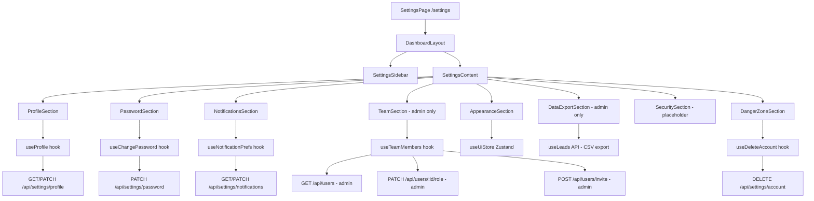
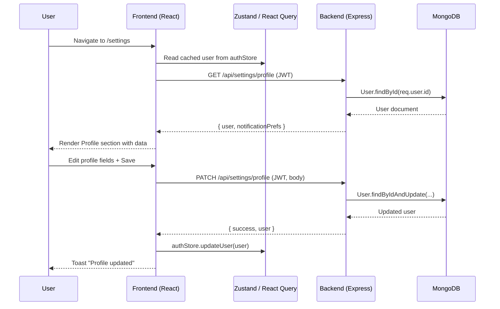

# Design Document: Settings Page

## Overview

The Settings page is a full-featured configuration hub for the SmartLeads dashboard, accessible at `/settings`. It provides a two-panel layout — a left sidebar for section navigation and a right content area — covering eight sections: Profile, Password & Security, Notifications, Team Members (admin only), Appearance, Data & Export (admin only), Security (placeholder), and Danger Zone. The feature spans both frontend (React + TypeScript) and backend (Node.js/Express + MongoDB), adding new API routes under `/api/settings` and `/api/users` while reusing all existing UI primitives and auth/role middleware.

The design follows the existing dashboard patterns: dark theme (`bg-[#111827]`, `bg-[#1a2332]`), Tailwind CSS utility classes, Zustand for client state, React Query for server state, and Zod for validation on both ends.

---

## Architecture



### Data Flow



---

## Components and Interfaces

### Component: SettingsPage

**Purpose**: Top-level page component, owns the active section state, renders layout.

**Interface**:
```typescript
// pages/SettingsPage.tsx
export default function SettingsPage(): JSX.Element
```

**Responsibilities**:
- Renders `DashboardLayout` wrapper
- Manages `activeSection` state (default: `'profile'`)
- Passes `activeSection` and `setActiveSection` to `SettingsSidebar`
- Renders the correct section component based on `activeSection`
- Guards admin-only sections by checking `user.role === 'admin'`

---

### Component: SettingsSidebar

**Purpose**: Left navigation panel listing all settings sections.

**Interface**:
```typescript
interface SettingsSidebarProps {
  activeSection: SettingsSection;
  onSelect: (section: SettingsSection) => void;
  isAdmin: boolean;
}

type SettingsSection =
  | 'profile'
  | 'password'
  | 'notifications'
  | 'team'
  | 'appearance'
  | 'data-export'
  | 'security'
  | 'danger-zone';
```

**Responsibilities**:
- Renders nav items with icons (lucide-react)
- Highlights active section with `bg-indigo-600 text-white`
- Hides `team` and `data-export` items when `isAdmin` is false
- Renders `danger-zone` item in red (`text-red-400`)

---

### Component: ProfileSection

**Purpose**: Displays and edits user profile fields.

**Interface**:
```typescript
interface ProfileSectionProps {}  // reads from hooks internally
```

**Responsibilities**:
- Shows avatar circle with initials (derived from `name`)
- Avatar upload button (triggers file input, uploads to `/api/settings/avatar`)
- Form fields: First Name, Last Name, Email (read-only), Role badge (read-only), Timezone selector
- Cancel (resets form) and Save Changes (PATCH) buttons
- Displays inline validation errors and loading state

---

### Component: PasswordSection

**Purpose**: Allows users to change their password.

**Interface**:
```typescript
interface PasswordSectionProps {}
```

**Responsibilities**:
- Three password fields: Current Password, New Password, Confirm Password
- Password strength indicator bar (computed from new password entropy)
- Validates: min 8 chars, new ≠ current, confirm matches new
- Submits PATCH `/api/settings/password`
- Clears fields on success

---

### Component: NotificationsSection

**Purpose**: Toggle switches for notification preferences.

**Interface**:
```typescript
interface NotificationPrefs {
  newLeadAdded: boolean;
  statusChanged: boolean;
  leadDeleted: boolean;
  csvExportDone: boolean;
  weeklySummaryEmail: boolean;
}
```

**Responsibilities**:
- Renders a `ToggleSwitch` for each preference
- Optimistic UI: updates local state immediately, syncs to backend
- Auto-saves on toggle (no explicit save button)

---

### Component: TeamSection (admin only)

**Purpose**: Lists all users with role management and invite capability.

**Interface**:
```typescript
interface TeamMember {
  _id: string;
  name: string;
  email: string;
  role: UserRole;
  createdAt: string;
}
```

**Responsibilities**:
- Fetches all users via GET `/api/users` (admin-only route)
- Renders each member row: avatar initials, name, email, role badge, Edit Role button
- Edit Role opens an inline dropdown or modal to change role
- "Invite New Member" button opens `InviteMemberModal`
- Shows empty state if no team members

---

### Component: AppearanceSection

**Purpose**: Controls UI preferences stored in `uiStore`.

**Interface**:
```typescript
interface AppearancePrefs {
  darkMode: boolean;
  compactRows: boolean;
  leadsPerPage: 10 | 25 | 50;
}
```

**Responsibilities**:
- Dark Mode toggle (reads/writes `uiStore.darkMode`)
- Compact Rows toggle (new `uiStore.compactRows` field)
- Default Leads Per Page selector (10/25/50) — persisted to `localStorage`
- Changes apply immediately (no save button needed)

---

### Component: DataExportSection (admin only)

**Purpose**: Bulk data operations for admins.

**Interface**:
```typescript
interface DataExportSectionProps {}
```

**Responsibilities**:
- "Export All Leads as CSV" button — calls existing `downloadLeadsCSV()` utility
- Default Sort Order preference selector (`latest` / `oldest`) — persisted to `localStorage`
- Shows loading spinner during export

---

### Component: SecuritySection

**Purpose**: Placeholder for future session management features.

**Responsibilities**:
- Renders a "Coming Soon" card with description
- Lists planned features: active sessions, device management

---

### Component: DangerZoneSection

**Purpose**: Irreversible account deletion with confirmation.

**Interface**:
```typescript
interface DeleteAccountModalProps {
  isOpen: boolean;
  onClose: () => void;
  onConfirm: () => void;
  isLoading: boolean;
}
```

**Responsibilities**:
- Red-bordered danger card with warning text
- "Delete Account" button opens `DeleteAccountModal`
- Modal requires typing `"DELETE"` to confirm
- On confirm: calls DELETE `/api/settings/account`, then `authStore.logout()`

---

### Component: ToggleSwitch (new UI primitive)

**Purpose**: Reusable accessible toggle switch.

**Interface**:
```typescript
interface ToggleSwitchProps {
  checked: boolean;
  onChange: (checked: boolean) => void;
  label: string;
  description?: string;
  disabled?: boolean;
}
```

---

## Data Models

### Extended User Model (Backend)

```typescript
// Additions to User.model.ts
interface IUserDocument extends Document {
  // existing fields...
  name: string;
  email: string;
  password: string;
  role: UserRole;
  // new fields:
  firstName?: string;
  lastName?: string;
  timezone?: string;
  avatarUrl?: string;
  notificationPrefs: NotificationPrefs;
  createdAt: Date;
  updatedAt: Date;
}

interface NotificationPrefs {
  newLeadAdded: boolean;
  statusChanged: boolean;
  leadDeleted: boolean;
  csvExportDone: boolean;
  weeklySummaryEmail: boolean;
}
```

**Validation Rules**:
- `firstName` / `lastName`: optional, max 50 chars each
- `timezone`: optional, must be a valid IANA timezone string
- `avatarUrl`: optional, valid URL string
- `notificationPrefs`: all fields default to `true`

### Settings API Request/Response Types

```typescript
// PATCH /api/settings/profile
interface UpdateProfilePayload {
  firstName?: string;
  lastName?: string;
  timezone?: string;
}

// PATCH /api/settings/password
interface ChangePasswordPayload {
  currentPassword: string;
  newPassword: string;
  confirmPassword: string;
}

// PATCH /api/settings/notifications
interface UpdateNotificationsPayload {
  notificationPrefs: Partial<NotificationPrefs>;
}

// PATCH /api/users/:id/role
interface UpdateUserRolePayload {
  role: UserRole;
}

// POST /api/users/invite
interface InviteMemberPayload {
  name: string;
  email: string;
  role: UserRole;
}
```

---

## Algorithmic Pseudocode

### Profile Update Algorithm

```pascal
PROCEDURE updateProfile(userId, payload)
  INPUT: userId (string), payload (UpdateProfilePayload)
  OUTPUT: UpdatedUser | AppError

  PRECONDITIONS:
    - userId is a valid MongoDB ObjectId
    - payload fields pass Zod schema validation
    - req.user.id === userId (users can only update own profile)

  SEQUENCE
    user ← User.findById(userId)

    IF user IS NULL THEN
      THROW AppError("User not found", 404)
    END IF

    // Merge name from firstName + lastName if both provided
    IF payload.firstName IS NOT NULL AND payload.lastName IS NOT NULL THEN
      user.name ← payload.firstName + " " + payload.lastName
    ELSE IF payload.firstName IS NOT NULL THEN
      user.name ← payload.firstName + " " + getLastName(user.name)
    ELSE IF payload.lastName IS NOT NULL THEN
      user.name ← getFirstName(user.name) + " " + payload.lastName
    END IF

    IF payload.timezone IS NOT NULL THEN
      ASSERT isValidIANATimezone(payload.timezone)
      user.timezone ← payload.timezone
    END IF

    updatedUser ← user.save()
    RETURN sanitizeUser(updatedUser)
  END SEQUENCE

  POSTCONDITIONS:
    - Returned user object excludes password field
    - user.name reflects merged firstName + lastName
    - updatedAt timestamp is refreshed
END PROCEDURE
```

### Password Change Algorithm

```pascal
PROCEDURE changePassword(userId, payload)
  INPUT: userId (string), payload (ChangePasswordPayload)
  OUTPUT: void | AppError

  PRECONDITIONS:
    - payload.newPassword.length >= 8
    - payload.newPassword === payload.confirmPassword
    - payload.currentPassword !== payload.newPassword

  SEQUENCE
    user ← User.findById(userId).select("+password")

    IF user IS NULL THEN
      THROW AppError("User not found", 404)
    END IF

    isMatch ← user.comparePassword(payload.currentPassword)

    IF NOT isMatch THEN
      THROW AppError("Current password is incorrect", 400)
    END IF

    IF payload.newPassword EQUALS payload.currentPassword THEN
      THROW AppError("New password must differ from current password", 400)
    END IF

    user.password ← payload.newPassword  // pre-save hook hashes it
    user.save()

    RETURN { success: true, message: "Password updated successfully" }
  END SEQUENCE

  POSTCONDITIONS:
    - Password is stored as bcrypt hash (pre-save hook fires)
    - No plaintext password is returned or logged
    - Existing JWT tokens remain valid (stateless JWT design)
END PROCEDURE
```

### Team Role Update Algorithm

```pascal
PROCEDURE updateUserRole(adminId, targetUserId, newRole)
  INPUT: adminId (string), targetUserId (string), newRole (UserRole)
  OUTPUT: UpdatedUser | AppError

  PRECONDITIONS:
    - req.user.role === 'admin'  (enforced by requireRole middleware)
    - newRole ∈ { 'admin', 'sales_user' }
    - adminId !== targetUserId  (prevent self-demotion)

  SEQUENCE
    IF adminId EQUALS targetUserId THEN
      THROW AppError("Cannot change your own role", 400)
    END IF

    user ← User.findByIdAndUpdate(
      targetUserId,
      { role: newRole },
      { new: true, runValidators: true }
    )

    IF user IS NULL THEN
      THROW AppError("User not found", 404)
    END IF

    RETURN sanitizeUser(user)
  END SEQUENCE

  POSTCONDITIONS:
    - Target user's role is updated in DB
    - Admin's own role is unchanged
    - Returned user excludes password
END PROCEDURE
```

### Password Strength Computation

```pascal
FUNCTION computePasswordStrength(password)
  INPUT: password (string)
  OUTPUT: { score: 0..4, label: string, color: string }

  SEQUENCE
    score ← 0

    IF password.length >= 8 THEN score ← score + 1 END IF
    IF password.length >= 12 THEN score ← score + 1 END IF
    IF password MATCHES /[A-Z]/ AND password MATCHES /[a-z]/ THEN
      score ← score + 1
    END IF
    IF password MATCHES /[0-9]/ THEN score ← score + 1 END IF
    IF password MATCHES /[^A-Za-z0-9]/ THEN score ← score + 1 END IF

    // Cap at 4
    score ← MIN(score, 4)

    RETURN MATCH score WITH
      | 0 → { score: 0, label: "Too weak",  color: "bg-red-500" }
      | 1 → { score: 1, label: "Weak",      color: "bg-orange-500" }
      | 2 → { score: 2, label: "Fair",      color: "bg-yellow-500" }
      | 3 → { score: 3, label: "Good",      color: "bg-blue-500" }
      | 4 → { score: 4, label: "Strong",    color: "bg-green-500" }
    END MATCH
  END SEQUENCE

  POSTCONDITIONS:
    - score ∈ { 0, 1, 2, 3, 4 }
    - label and color are consistent with score
    - Pure function: no side effects
END FUNCTION
```

---

## Key Functions with Formal Specifications

### `useProfile()` — Frontend Hook

```typescript
function useProfile(): {
  profile: ProfileData | undefined;
  isLoading: boolean;
  updateProfile: (payload: UpdateProfilePayload) => Promise<void>;
  isUpdating: boolean;
}
```

**Preconditions:**
- User is authenticated (JWT present in `authStore`)
- Component is mounted inside `QueryClientProvider`

**Postconditions:**
- `profile` reflects the latest server state after successful update
- `authStore.user.name` is updated to match new profile name
- On error: toast notification shown, form state preserved

---

### `useChangePassword()` — Frontend Hook

```typescript
function useChangePassword(): {
  changePassword: (payload: ChangePasswordPayload) => Promise<void>;
  isLoading: boolean;
}
```

**Preconditions:**
- `payload.newPassword.length >= 8`
- `payload.newPassword === payload.confirmPassword`

**Postconditions:**
- On success: form fields cleared, success toast shown
- On error: error message displayed inline, fields preserved

---

### `useTeamMembers()` — Frontend Hook

```typescript
function useTeamMembers(): {
  members: TeamMember[];
  isLoading: boolean;
  updateRole: (userId: string, role: UserRole) => Promise<void>;
  inviteMember: (payload: InviteMemberPayload) => Promise<void>;
}
```

**Preconditions:**
- `user.role === 'admin'` (component only rendered for admins)

**Postconditions:**
- After `updateRole`: member list re-fetched, role badge updated
- After `inviteMember`: new member appears in list, invite modal closes

---

## Example Usage

```typescript
// SettingsPage.tsx — section routing
const [activeSection, setActiveSection] = useState<SettingsSection>('profile');
const { user } = useAuthStore();
const isAdmin = user?.role === 'admin';

const sectionMap: Record<SettingsSection, React.ReactNode> = {
  'profile':      <ProfileSection />,
  'password':     <PasswordSection />,
  'notifications': <NotificationsSection />,
  'team':         isAdmin ? <TeamSection /> : null,
  'appearance':   <AppearanceSection />,
  'data-export':  isAdmin ? <DataExportSection /> : null,
  'security':     <SecuritySection />,
  'danger-zone':  <DangerZoneSection />,
};

// ProfileSection.tsx — avatar initials
const getInitials = (name: string): string => {
  const parts = name.trim().split(' ');
  if (parts.length >= 2) return (parts[0][0] + parts[parts.length - 1][0]).toUpperCase();
  return name.slice(0, 2).toUpperCase();
};

// PasswordSection.tsx — strength indicator
const strength = computePasswordStrength(newPassword);
// → { score: 3, label: "Good", color: "bg-blue-500" }

// NotificationsSection.tsx — optimistic toggle
const handleToggle = async (key: keyof NotificationPrefs, value: boolean) => {
  setPrefs(prev => ({ ...prev, [key]: value }));  // optimistic
  try {
    await updateNotifications({ notificationPrefs: { [key]: value } });
  } catch {
    setPrefs(prev => ({ ...prev, [key]: !value }));  // rollback
    toast.error('Failed to save preference');
  }
};
```

---

## Correctness Properties

- **Profile isolation**: A user can only update their own profile. `∀ req: req.user.id !== targetId → 403 Forbidden`
- **Password hashing**: Plaintext passwords are never stored. `∀ save: user.password = bcrypt.hash(plaintext, saltRounds)`
- **Role guard**: Admin-only sections/routes are inaccessible to `sales_user`. `∀ req with role='sales_user' on admin route → 403`
- **Self-role protection**: An admin cannot change their own role. `∀ req: req.user.id === targetUserId → 400 Bad Request`
- **Password confirmation**: New password is only accepted when `newPassword === confirmPassword`
- **Notification atomicity**: Each toggle saves independently; a failure on one does not affect others
- **Danger zone confirmation**: Account deletion requires explicit `"DELETE"` text input before the API call is made
- **Appearance persistence**: Dark mode and compact rows preferences survive page refresh via `localStorage`

---

## Error Handling

### Profile Update Errors

| Condition | HTTP Status | User-Facing Message |
|-----------|-------------|---------------------|
| Invalid timezone string | 400 | "Please select a valid timezone" |
| Name too long (>100 chars) | 400 | "Name cannot exceed 100 characters" |
| Unauthorized (no JWT) | 401 | Redirect to `/login` |

### Password Change Errors

| Condition | HTTP Status | User-Facing Message |
|-----------|-------------|---------------------|
| Current password wrong | 400 | "Current password is incorrect" |
| New password < 8 chars | 400 (client) | "Password must be at least 8 characters" |
| Confirm mismatch | 400 (client) | "Passwords do not match" |
| Same as current | 400 | "New password must differ from current" |

### Team Management Errors

| Condition | HTTP Status | User-Facing Message |
|-----------|-------------|---------------------|
| Non-admin access | 403 | "Access denied" |
| Self-role change | 400 | "Cannot change your own role" |
| Invite duplicate email | 409 | "An account with this email already exists" |

### Danger Zone Errors

| Condition | HTTP Status | User-Facing Message |
|-----------|-------------|---------------------|
| Confirmation text mismatch | N/A (client) | "Please type DELETE to confirm" |
| Server error during deletion | 500 | "Failed to delete account. Please try again." |

---

## Testing Strategy

### Unit Testing Approach

- `computePasswordStrength()`: test all score boundaries (0–4) with representative inputs
- `getInitials()`: single name, two-part name, multi-part name, empty string edge case
- `SettingsSidebar`: verify admin-only items hidden for `sales_user`, visible for `admin`
- `ToggleSwitch`: verify `onChange` fires with correct boolean, ARIA attributes present
- `DeleteAccountModal`: verify confirm button disabled until `"DELETE"` typed

### Property-Based Testing Approach

**Property Test Library**: fast-check

- **Password strength monotonicity**: Adding characters to a password never decreases its strength score
  - `∀ p: string, c: char → strength(p + c).score >= strength(p).score` (approximately)
- **Initials length**: `getInitials(name)` always returns a string of length 1 or 2
  - `∀ name: non-empty string → getInitials(name).length ∈ {1, 2}`
- **Profile update idempotency**: Applying the same profile update twice yields the same result
  - `∀ payload → updateProfile(updateProfile(user, payload), payload) === updateProfile(user, payload)`

### Integration Testing Approach

- `GET /api/settings/profile`: returns correct user data for authenticated user
- `PATCH /api/settings/profile`: updates name/timezone, returns sanitized user (no password)
- `PATCH /api/settings/password`: rejects wrong current password, accepts valid change
- `GET /api/users`: returns 403 for `sales_user`, returns user list for `admin`
- `PATCH /api/users/:id/role`: returns 400 when admin tries to change own role
- `DELETE /api/settings/account`: deletes user and returns 200

---

## Performance Considerations

- Profile and notification data are fetched once on section mount and cached by React Query (`staleTime: 30_000` matching existing config)
- Team member list uses the same React Query cache; invalidated after role update or invite
- Avatar upload uses `multipart/form-data`; file size limited to 2MB on the backend
- CSV export reuses the existing `downloadLeadsCSV()` utility — no new backend endpoint needed
- Appearance preferences (dark mode, compact rows, leads-per-page) are read from `localStorage` synchronously — no network request

---

## Security Considerations

- All `/api/settings/*` routes require `authMiddleware` (JWT verification)
- `/api/users` and `/api/users/:id/role` additionally require `requireRole('admin')`
- Profile update endpoint validates that `req.user.id === req.params.id` (or uses `req.user.id` directly) to prevent horizontal privilege escalation
- Password change requires the current password to be verified before accepting the new one
- Account deletion is a hard delete — no soft-delete or recovery mechanism in v1
- Avatar uploads validate MIME type (`image/jpeg`, `image/png`, `image/webp`) and file size server-side
- Invite endpoint creates a user with a temporary password; the invited user must change it on first login (future enhancement — noted as placeholder)

---

## Dependencies

### Frontend (no new packages required)
- `react`, `react-dom`, `react-router-dom` — already installed
- `@tanstack/react-query` — already installed
- `zustand` — already installed
- `react-hot-toast` — already installed
- `lucide-react` — already installed (icons for settings nav)
- `tailwindcss` — already installed

### Backend (no new packages required)
- `express`, `mongoose`, `bcryptjs`, `jsonwebtoken` — already installed
- `zod` — already installed (validation schemas)
- `multer` — **new dependency** for avatar file upload handling

### New Files to Create

**Frontend:**
- `src/pages/SettingsPage.tsx` (replace placeholder)
- `src/components/settings/SettingsSidebar.tsx`
- `src/components/settings/ProfileSection.tsx`
- `src/components/settings/PasswordSection.tsx`
- `src/components/settings/NotificationsSection.tsx`
- `src/components/settings/TeamSection.tsx`
- `src/components/settings/AppearanceSection.tsx`
- `src/components/settings/DataExportSection.tsx`
- `src/components/settings/SecuritySection.tsx`
- `src/components/settings/DangerZoneSection.tsx`
- `src/components/ui/ToggleSwitch.tsx`
- `src/api/settings.api.ts`
- `src/hooks/useProfile.ts`
- `src/hooks/useChangePassword.ts`
- `src/hooks/useNotificationPrefs.ts`
- `src/hooks/useTeamMembers.ts`

**Backend:**
- `src/controllers/settings.controller.ts`
- `src/controllers/users.controller.ts`
- `src/routes/settings.routes.ts`
- `src/routes/users.routes.ts`
- `src/services/settings.service.ts`
- `src/services/users.service.ts`
- `src/schemas/settings.schema.ts`
